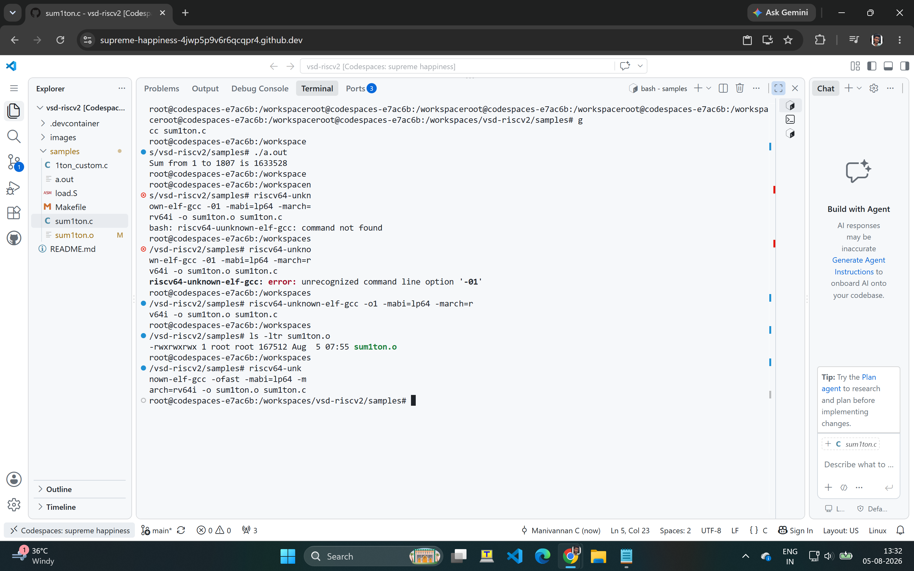
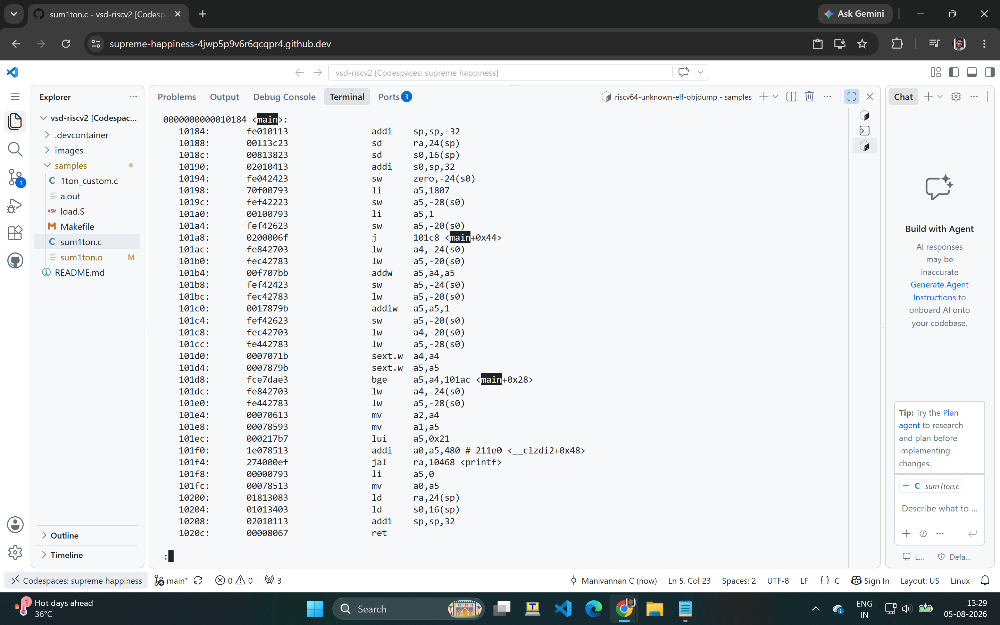
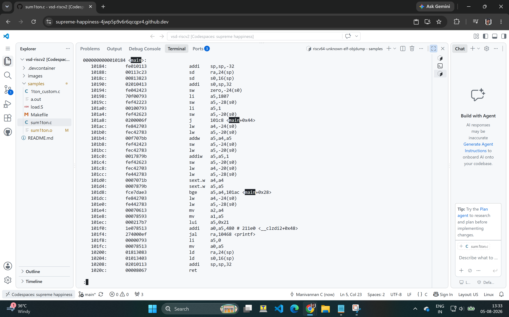
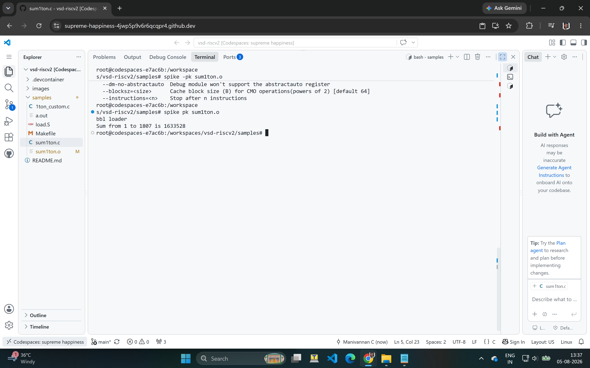
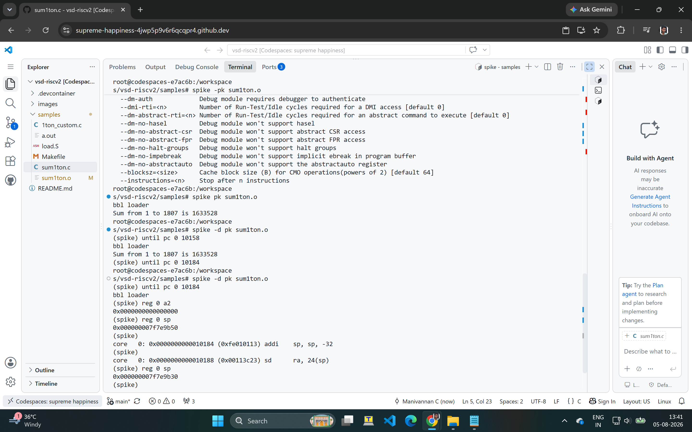
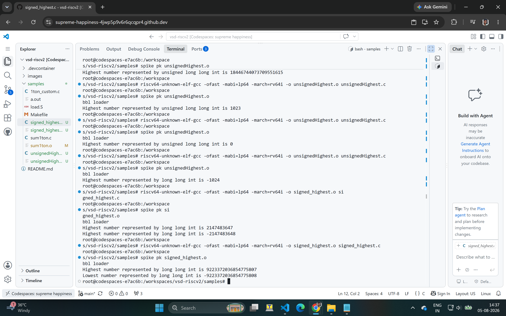
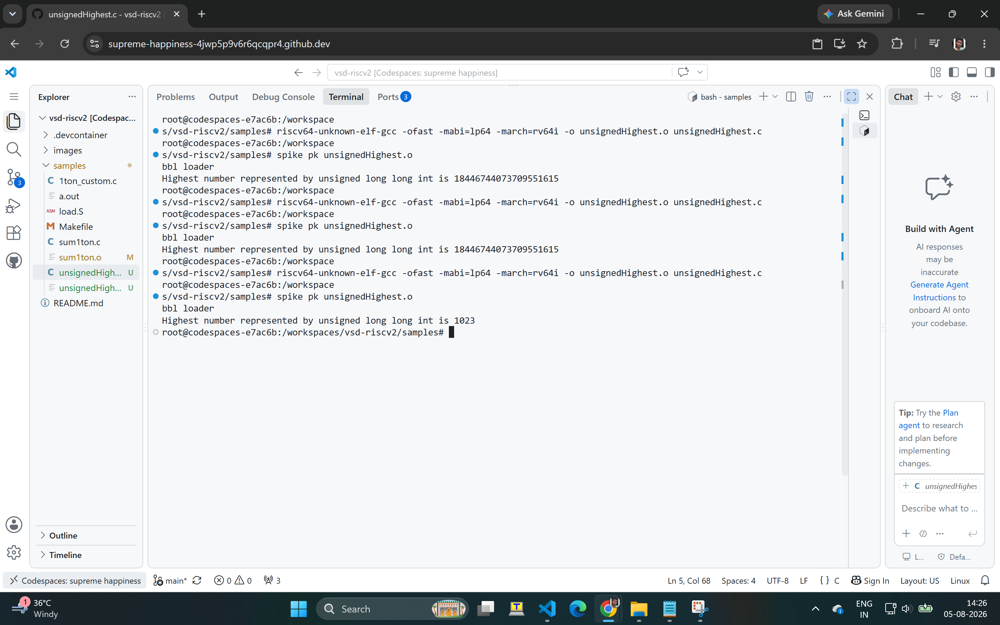
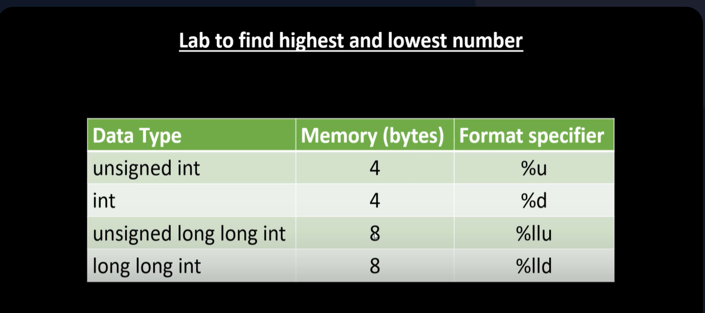

# Day 1 — Introduction to RISC-V ISA and GNU Compiler Toolchain

Day 1 covers the basics of the RISC-V ISA, the GNU cross-compiler toolchain, simulating a compiled RISC-V binary using Spike, and integer number representation.

---

## RV-D1SK2 — Labwork for RISC-V Software Toolchain

### Lab 1 — Compile and Run a C Program Natively

Wrote a simple C program (`sum1ton.c`) that computes the sum from 1 to n, compiled it with the native `gcc`, and ran it to confirm correct output before cross-compiling for RISC-V.

```c
#include <stdio.h>

int main(){
    int i, sum=0, n=1807;
    for(i=1;i<=n;i++)
        sum = sum + i;
    printf("Sum from 1 to %d is %d \n",n,sum);
    return 0;
}
```

```
$ gcc sum1ton.c
$ ./a.out
Sum from 1 to 1807 is 1633528
```



---

### Lab 2 — Cross-Compile with the RISC-V GNU Toolchain

Cross-compiled the same program using `riscv64-unknown-elf-gcc`, then used `objdump` to view the generated RISC-V assembly for the `main` function.

```
$ riscv64-unknown-elf-gcc -O1 -mabi=lp64 -march=rv64i -o sum1ton.o sum1ton.c
$ riscv64-unknown-elf-objdump -d sum1ton.o
```

> **Note:** initially mistyped `-01` (zero-one) instead of `-O1` (capital-O-one) — GCC rejected it with `unrecognized command line option '-01'`. Fixed by correcting the flag.



Also compared the disassembly using the `-Ofast` optimization flag to see how instruction count/selection changes with a more aggressive optimization level:

```
$ riscv64-unknown-elf-gcc -Ofast -mabi=lp64 -march=rv64i -o sum1ton.o sum1ton.c
```



---

### Lab 3 — Simulate the RISC-V Binary with Spike

Used **Spike**, the RISC-V ISA simulator, to run the cross-compiled binary and confirm it produces the same output as the native run.

```
$ spike pk sum1ton.o
bbl loader
Sum from 1 to 1807 is 1633528
```



Then used Spike's interactive debug mode (`-d`) to step through the program instruction-by-instruction and inspect register values directly, verifying the compiled instructions matched expected program logic.

```
$ spike -d pk sum1ton.o
(spike) until pc 0 10158
(spike) reg 0 sp
(spike) reg 0 a5
...
```



---

## RV-D1SK3 — Integer Number Representation

### Signed Integer Range

Wrote a program to compute the highest and lowest values representable by a `long long int` (signed, 64-bit).

```c
#include <stdio.h>
#include <math.h>

int main() {
    long long int max = (int) (pow(2,63) -1);
    long long int min = (int) (pow(2,63) * -1);
    printf("Highest number represented by long long int is %lld\n",max);
    printf("Lowest number represented by long long int is %lld\n",min);
    return 0;
}
```

> **Bug found and fixed:** the initial version cast `pow(2,63)` to `(int)` — a 32-bit type — before assigning to the 64-bit `long long int`, which truncates/overflows the value instead of correctly representing the 64-bit range. Corrected version uses `LLONG_MAX` / `LLONG_MIN` from `<limits.h>` instead of computing via `pow()`:

```c
#include <stdio.h>
#include <limits.h>

int main() {
    long long int max = LLONG_MAX;
    long long int min = LLONG_MIN;
    printf("Highest number represented by long long int is %lld\n", max);
    printf("Lowest number represented by long long int is %lld\n", min);
    return 0;
}
```



### Unsigned Integer Range

```c
#include <stdio.h>
#include <math.h>

int main() {
    unsigned long long int max = (unsigned long long int) (pow(2,64) -1);
    printf("Highest number represented by unsigned long long int is %llu\n",max);
    return 0;
}
```



Also referenced correct `printf` format specifiers for signed/unsigned 64-bit types (`%lld` vs `%llu`) while debugging this lab:



---

## Key Takeaways from Day 1

- How a C program is compiled and cross-compiled for a different ISA (host `gcc` vs `riscv64-unknown-elf-gcc`)
- How to read RISC-V disassembly output (`objdump -d`) and map it back to the C source
- How optimization flags (`-O1` vs `-Ofast`) affect instruction selection
- How to run and debug a RISC-V binary using Spike's functional simulator
- Why casting to a smaller type (`int`) before assigning to a 64-bit variable silently truncates the value — and why using standard limit macros (`LLONG_MAX`/`LLONG_MIN`) is safer than computing bounds manually with `pow()`
