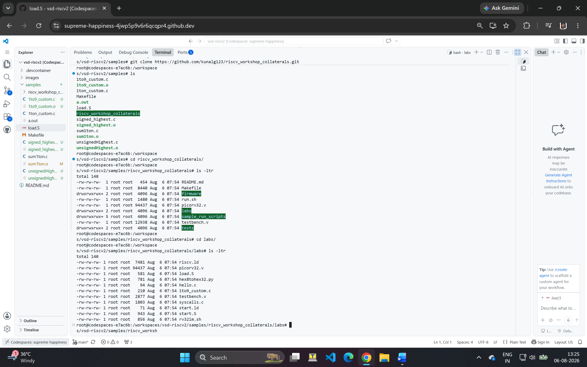
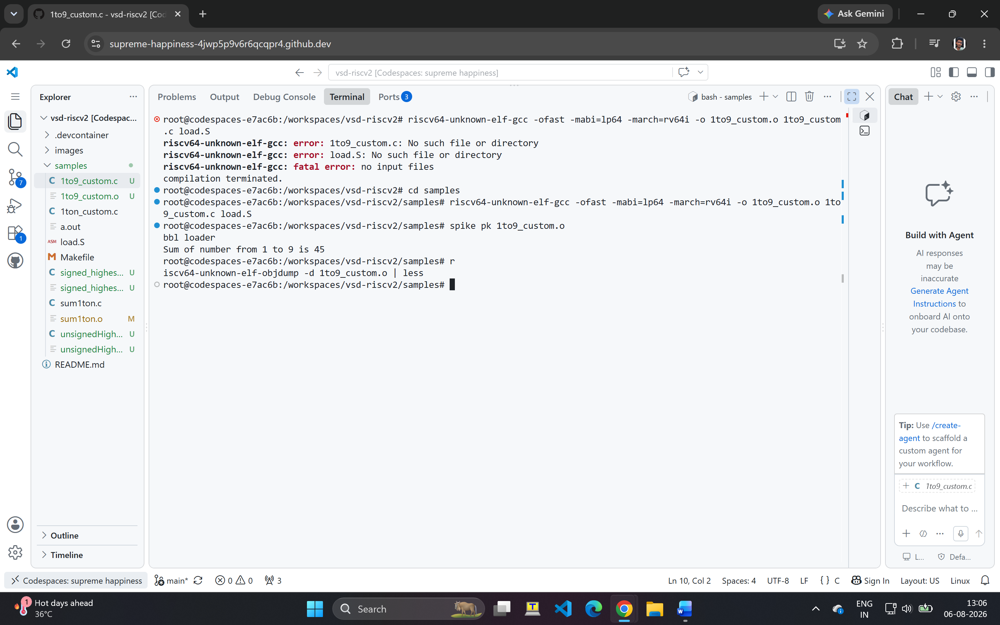
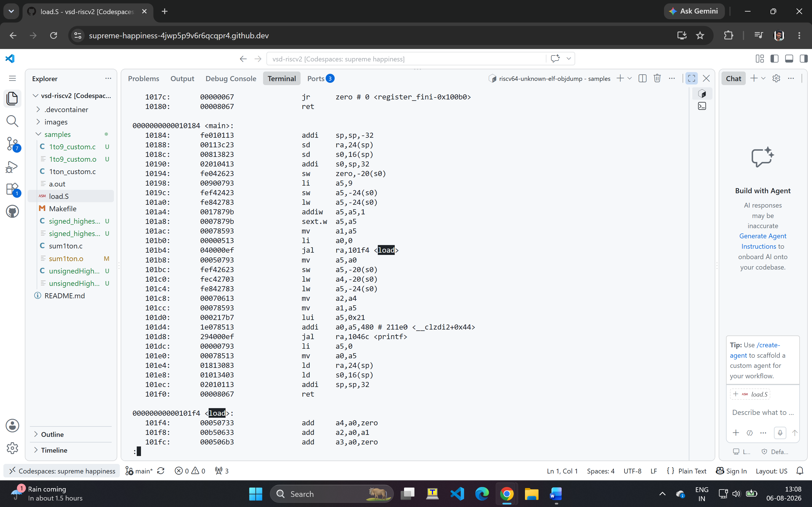

# Day 2 — Introduction to ABI and Basic Verification Flow

Day 2 moves from plain C compilation into running C programs on an actual RISC-V CPU RTL simulation (picorv32), via a custom assembly function (`load.S`) called from C, and understanding the RISC-V calling convention (ABI).

---

## Setup — Cloning the Workshop Collaterals

Cloned Kunal Ghosh's reference repository containing the picorv32 core, testbench, and lab programs:

```
$ git clone https://github.com/kunalg123/riscv_workshop_collaterals.git
```



---

## Lab — Running a Custom C Program on picorv32 RTL Simulation

The lab program (`1to9_custom.c`) calls an external assembly function `load(x, y)` (defined in `load.S`) that sums numbers from 1 up to `y-1`, using registers passed per the RISC-V ABI:

```c
#include <stdio.h>

extern int load(int x, int y);

int main() {
    int result = 0;
    int count = 3;
    result = load(0x0, count+1);
    printf("Sum of number from 1 to %d is %d\n", count, result);
}
```

`load.S`:
```asm
.section .text
.global load
.type load, @function

load:
    add   a4, a0, zero  // Initialize sum register a4 with 0x0
    add   a2, a0, a1    // store upper bound in register a2
    add   a3, a0, zero  // initialize intermediate sum register a3 by 0
loop:
    add   a4, a3, a4    // Incremental addition
    addi  a3, a3, 1     // Increment intermediate register by 1
    blt   a3, a2, loop  // If a3 is less than a2, branch to label <loop>
    add   a0, a4, zero  // Store final result to register a0
    ret
```

Compiled and ran via the provided `rv32im.sh` script, which builds the RTL simulation (`iverilog` + `vvp`) using `testbench.v` and the `picorv32.v` core, memory-mapping the console output to address `0x10000000`.






### Debugging note

While testing with different values of `count`, the program printed the correct sum for `count = 2` and `count = 3`, but only showed `TRAP` (with no printed sum) for `count = 4` and `count = 5`.

Traced this by hand:
- `load.S`'s loop logic is correct for all tested values — the `blt a3, a2, loop` termination condition is not hardcoded to any specific range, so the assembly itself isn't the cause.
- `TRAP` in `testbench.v` is the **normal end-of-simulation message** (triggered by the CPU's own `trap` signal after the firmware finishes) — it appears on every run, successful or not. It is not itself an error indicator.
- The testbench has no fixed simulation-length cutoff (`$finish` is only called on the `trap` signal or on `CRITICAL UNDEF MEM TRANSACTION`), so it isn't a simulation-timeout issue either.
- This remains an open observation — the exact root cause (likely something in the bare-metal printf/console-write path for multi-digit values) was not conclusively isolated within the workshop timeline.

---

## Key Takeaways from Day 2

- How the RISC-V calling convention (ABI) passes arguments in registers (`a0`, `a1`, ...) between C and hand-written assembly
- How to compile, link, and run a C+assembly program against an actual RTL CPU simulation (not just an ISA simulator like Spike)
- How `testbench.v` bridges Verilog simulation memory-mapped I/O (`0x10000000`) to console output via `$write`
- That a `TRAP` message in this testbench is a normal termination signal, not necessarily an error — the real symptom to investigate is *missing expected output before* the trap, not the trap itself
