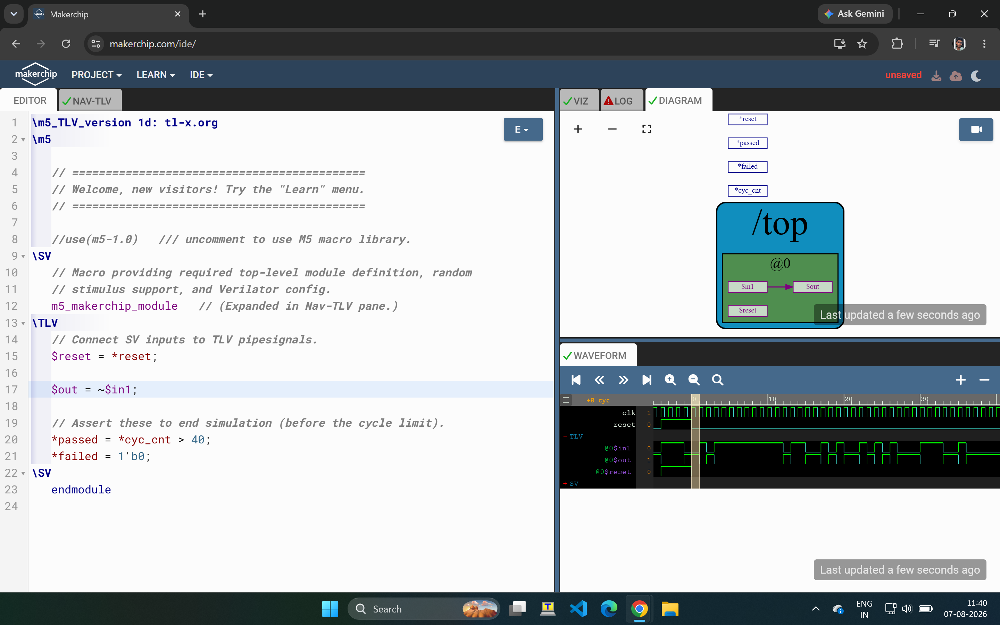
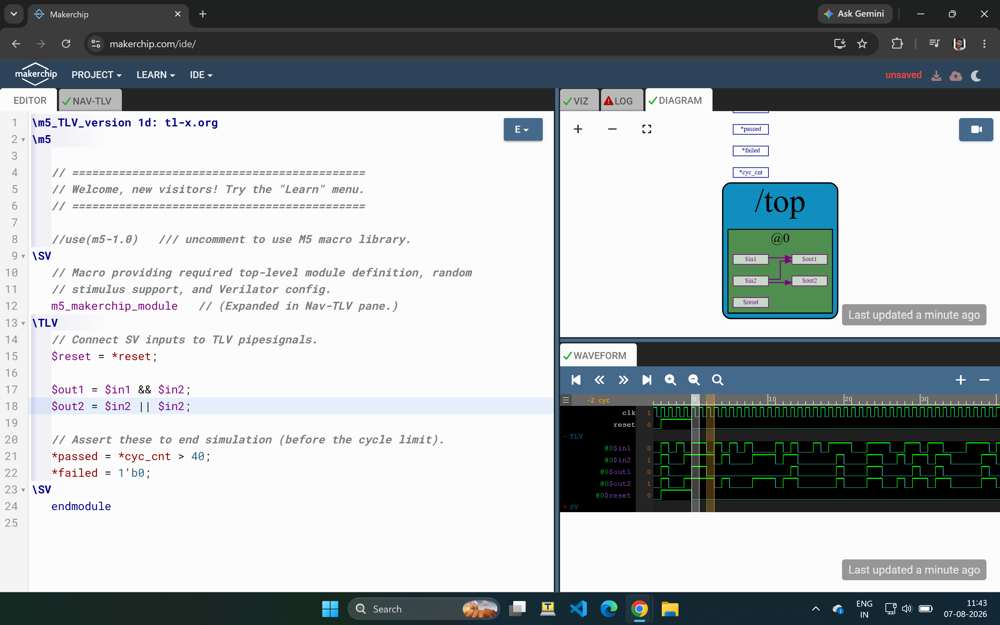
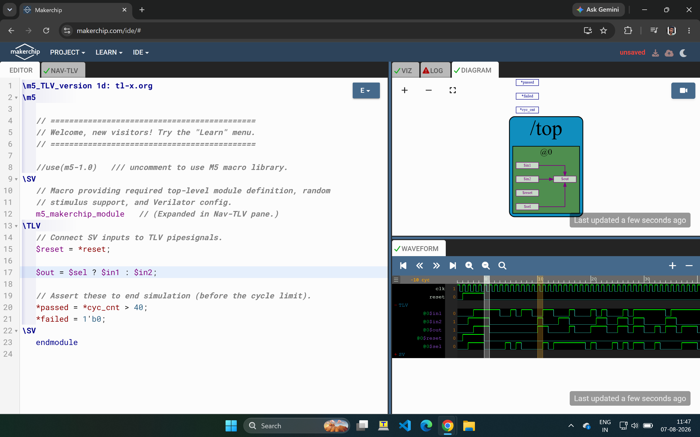
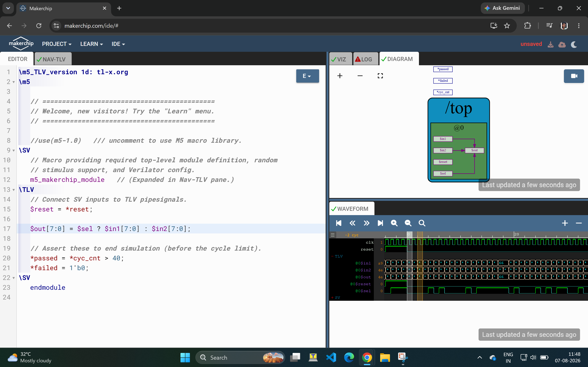
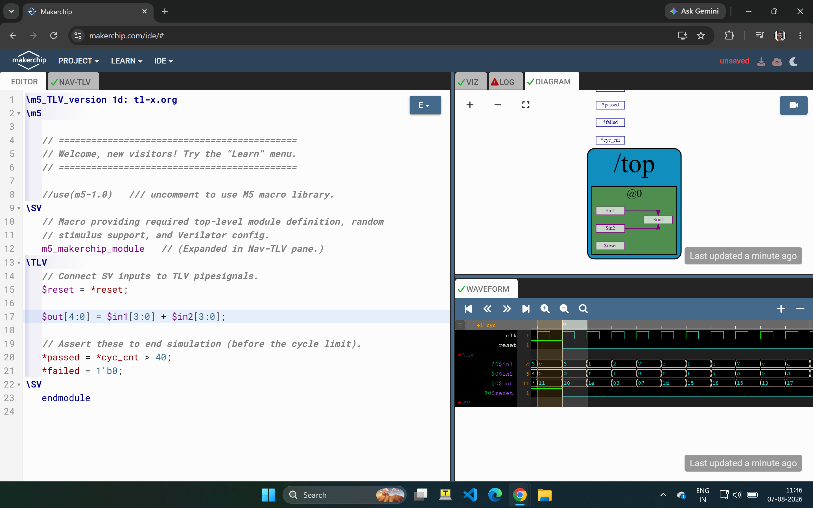
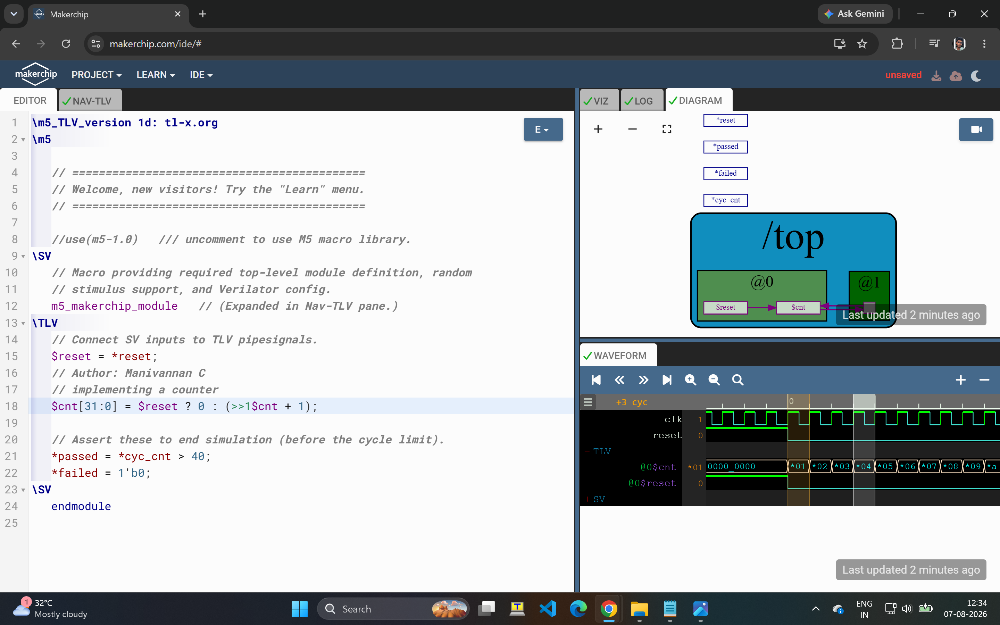
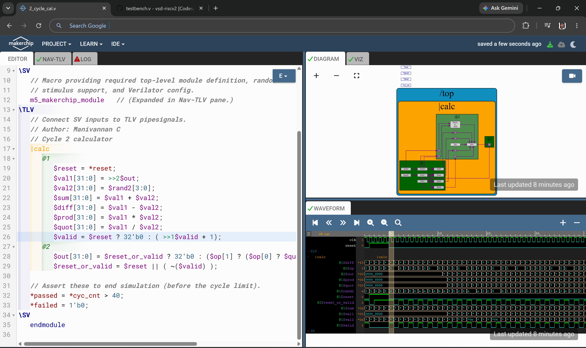
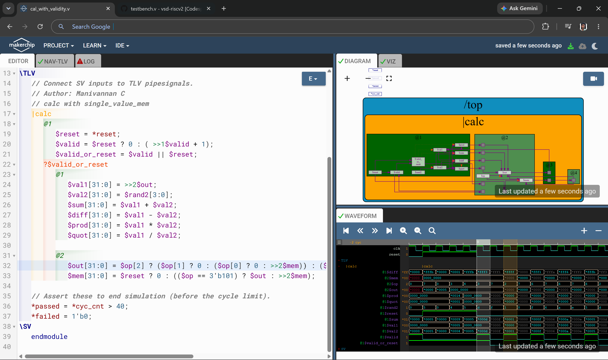
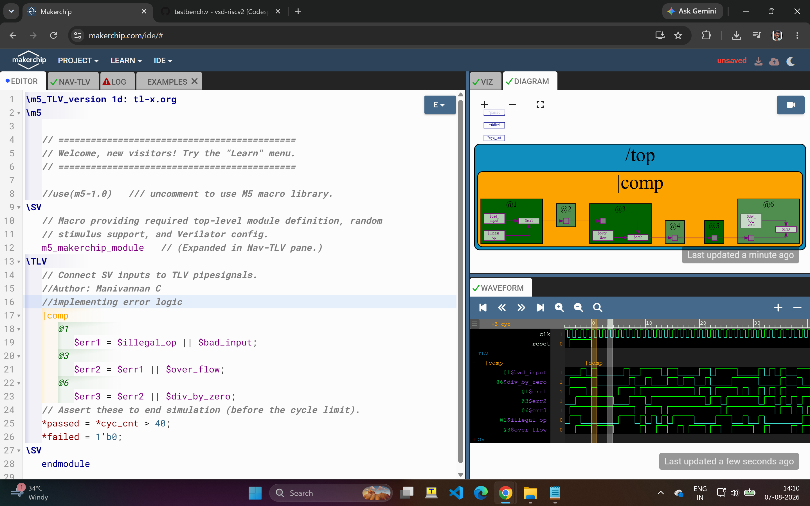
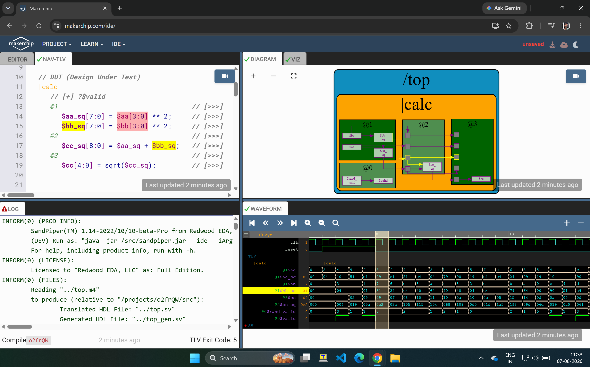

# Day 3 — Digital Logic with TL-Verilog and Makerchip

Day 3 introduces TL-Verilog syntax and the Makerchip IDE, building up from basic combinational logic to a pipelined, validity-tracked calculator with memory.

---

## Combinational Logic Labs

### Inverter
```tlv
$out = !$in1;
```


### Boolean Logic (AND / OR)
```tlv
$out1 = $in1 && $in2;
$out2 = $in1 || $in2;
```


### 1-bit Mux
```tlv
$out = $sel ? $in1 : $in2;
```


### 8-bit Vector Mux
```tlv
$out[7:0] = $sel ? $in1[7:0] : $in2[7:0];
```


### Vectors (4-bit adder)
```tlv
$out[4:0] = $in1[3:0] + $in2[3:0];
```


---

## Sequential Logic Labs

### Counter
```tlv
$cnt[31:0] = $reset ? 0 : (>>1$cnt + 1);
```
Demonstrates pipeline-relative referencing (`>>1$cnt`) to read the previous cycle's value of a signal — the core mechanism behind sequential logic in TL-Verilog.



### Combinational Calculator
```tlv
$reset = *reset;
$val1[31:0] = $rand1[3:0];
$val2[31:0] = $rand2[3:0];
$sum[31:0]  = $val1 + $val2;
$diff[31:0] = $val1 - $val2;
$prod[31:0] = $val1 * $val2;
$quot[31:0] = $val1 / $val2;
//              11      10          01      00
$out[31:0] = $op[1] ? ($op[0] ? $quot : $prod) : ($op[0] ? $diff : $sum);
```
A 4-function calculator (add/sub/mul/div) selected by a 2-bit opcode.


### Sequential Calculator
```tlv
$val1[31:0] = $reset ? 32'b0 : >>1$out;
$val2[31:0] = $rand2[3:0];
... (same sum/diff/prod/quot logic)
$out[31:0] = $reset ? 32'b0 : ($op[1] ? ($op[0] ? $quot : $prod) : ($op[0] ? $diff : $sum));
```
Extends the calculator to be sequential — each cycle's `$val1` feeds from the *previous* cycle's `$out`, chaining operations across cycles.


---

## Extended / Self-Directed Labs

Beyond the assigned labs, additional pipelined variations were implemented:

### 2-Cycle Calculator with Validity
```tlv
|calc
   @1
      $reset = *reset;
      $valid = $reset ? 0 : (>>1$valid + 1);
      $valid_or_reset = $valid || $reset;
   ?$valid_or_reset
      @1
         $val1[31:0] = >>2$out;
         ... (sum/diff/prod/quot as before)
      @2
         $out[31:0] = $op[1] ? ($op[0] ? $quot : $prod) : ($op[0] ? $diff : $sum);
```
Introduces a `$valid` signal and the `?$valid_or_reset` conditional-execution syntax, splitting computation across two pipeline stages (`@1`, `@2`).



### Calculator with Single-Value Memory

```tlv
|calc
   @1
      $reset = *reset;
      $valid = $reset ? 0 : (>>1$valid + 1);
      $valid_or_reset = $valid || $reset;
   ?$valid_or_reset
      @1
         $val1[31:0] = >>2$out;
         ... (sum/diff/prod/quot as before)
      @2
         $out[31:0] = $op[2] ? ($op[1] ? 0 : ($op[0] ? 0 : >>2$mem)) : (... as before ...);
         $mem[31:0] = $reset ? 0 : (($op == 3'b101) ? $out : >>2$mem);
```
Adds a single-register memory (`$mem`) that can be written and read back via additional opcode bits — a step toward register-file-like behavior.



### Error Logic (Pipelined Error Propagation)
```tlv
|comp
   @1
      $err1 = $illegal_op || $bad_input;
   @3
      $err2 = $err1 || $over_flow;
   @6
      $err3 = $err2 || $div_by_zero;
```
Demonstrates propagating an error/exception condition across multiple pipeline stages, accumulating additional error sources at each stage.



### Python Sample Replica


---

## File Naming — Corrected

Two files/images were mislabeled from working across labs quickly; corrected as follows:

| Before | After | Reason |
|---|---|---|
| `cal_with_validity.v` | `calc_with_single_val_mem.v` | File actually contains the memory-based calculator logic (confirmed via the Makerchip editor tab in the screenshot itself), matching the `cal_with_single_val_mem.png` image |
| `calc_with_single_val_mem.v` (old) | *(removed from Day 3)* | This file actually contained the first step of the Day 4 CPU build (PC implementation) — unrelated to any Day 3 calculator lab. Day 4's `pc.v` already covers this checkpoint |
| `calc_with_validity.png` | *(removed — duplicate)* | This screenshot's Makerchip tab shows `2_cycle_cal.v`, i.e. it documents the same lab as `2_cycle_cal.png`, not a separate "validity" variant |

Also removed `Codes.txt` — a raw, unformatted duplicate of code that now exists properly in the individual `.tlv` files above.

---

## Key Takeaways from Day 3

- TL-Verilog's `$signal` syntax and how it replaces explicit wire/reg declarations
- Pipeline-relative signal referencing (`>>1$signal`, `>>2$signal`) as the basis for sequential logic
- Conditional execution blocks (`?$condition`) for stage-gating logic
- Building up a calculator from purely combinational → sequential → validity-tracked → memory-backed, mirroring how real pipelined datapaths are constructed incrementally
