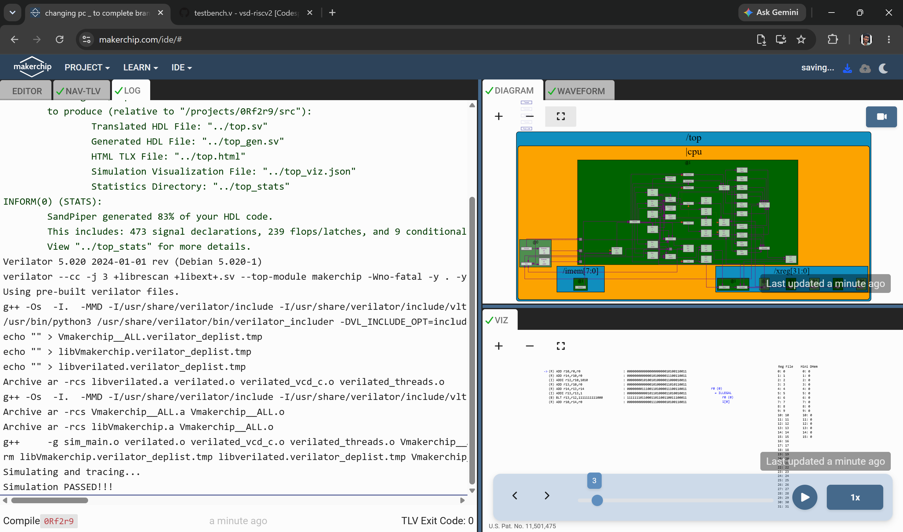

# Day 4 — Basic RISC-V CPU Microarchitecture

Day 4 builds a single-cycle RISC-V CPU core, incrementally, in TL-Verilog on Makerchip. Each file below is a complete checkpoint of the design at that stage — a running history of the build, not just the final result.

---

## Build Progression

| Step | File | What it adds |
|---|---|---|
| 1 | `pc.v` | Program Counter: increments by 4 each cycle, resets to 0 on `$reset` |
| 2 | `imem.v` | Instruction memory read: connects PC to the instruction memory macro (`m4+imem`), fetching the 32-bit instruction word |
| 3 | `decode.v` | Instruction-type decode: identifies R/I/S/B/U/J instruction formats from opcode bits |
| 4 | `immediate_added.v` | Immediate value extraction and sign-extension, per instruction format |
| 5 | `other_fields_added.v` | Extracts `rs1`, `rs2`, `rd`, `funct3`, `funct7`, `opcode` fields |
| 6 | `circled_inst.v` | Adds validity conditions for each field (e.g. `funct7` is only valid for R-type instructions) |
| 7 | `reg_files_read.v` | Wires up register file read enables/indices from `rs1`/`rs2` |
| 8 | `rf_rd_src.v` | Connects register file read data to source operand values (`$src1_value`, `$src2_value`) |
| 9 | `ALU_addi_add.v` | Implements the ALU computation for `ADD` and `ADDI` |
| 10 | `rf_wr_signals.v` | Register file write-enable and write-data logic (with the RISC-V rule that `x0` is never written) |
| 11 | `conditional_branches.v` | Adds branch condition evaluation (`BEQ`, `BNE`, `BLT`, `BGE`, `BLTU`, `BGEU`) |
| 12 | `changing pc _ to complete branch.v` | Feeds the branch decision back into the PC update logic |
| 13 | `RISCV_CPU.v` | **Final integrated core** — everything above combined and verified against the "sum 1 to 9" test program |

---

## Final Core (`RISCV_CPU.v`)

The completed single-cycle core:

- Fetches instructions via `$pc` → `$imem_rd_addr` → `$instr`
- Decodes instruction type (`$is_i_instr`, `$is_r_instr`, `$is_s_instr`, `$is_b_instr`, `$is_j_instr`, `$is_u_instr`)
- Extracts and sign-extends immediates per format
- Applies field validity conditions (`?$funct7_valid`, `?$rs1_valid`, etc.)
- Decodes specific instructions via `$dec_bits` (concatenation of `funct7[5]`, `funct3`, `opcode`) — covers `ADD`, `ADDI`, and all six branch instructions
- Reads/writes the register file, respecting the `x0`-is-always-zero rule
- Computes ALU results for `ADD`/`ADDI`
- Evaluates branch conditions (handling both signed and unsigned comparisons correctly, including the sign-bit XOR trick for signed `BLT`/`BGE`)
- Updates `$pc` based on whether a branch was taken (`$br_tgt_pc` vs `$pc + 4`)
- Verifies correctness against the test program:
  ```
  *passed = |cpu/xreg[10]>>5$value == (1 + 2 + 3 + 4 + 5 + 6 + 7 + 8 + 9);
  ```
  i.e. checks that register `x10` (a0) holds 45 after running the "sum 1 to 9" program through the core.




---

## Key Takeaways from Day 4

- How a single-cycle CPU datapath is built up incrementally: fetch → decode → register read → execute → register write → PC update
- How instruction fields (`opcode`, `funct3`, `funct7`, `rs1`, `rs2`, `rd`, immediates) are extracted differently depending on instruction format (R/I/S/B/U/J)
- Why field validity conditions matter (not every instruction has every field, e.g. `funct7` only exists for R-type)
- How branch conditions differ for signed vs. unsigned comparisons at the hardware level
- How to verify a CPU design in Makerchip by checking final register state against an expected computed result
