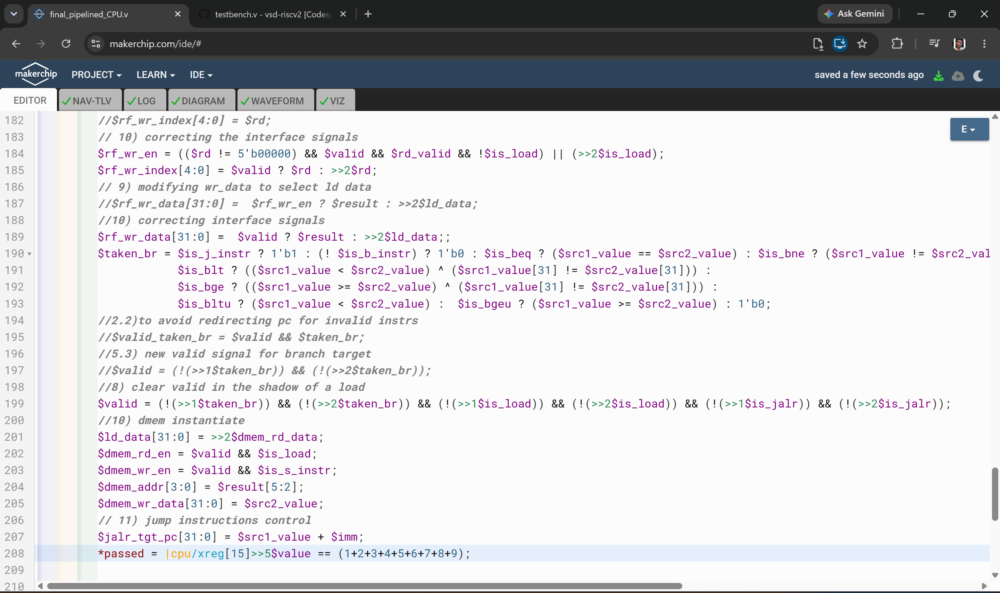
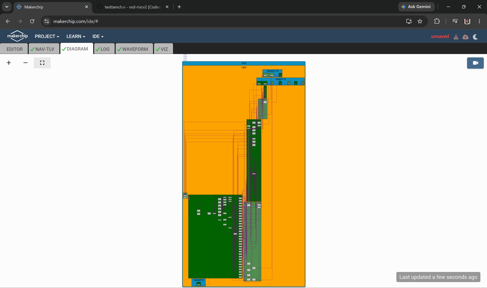
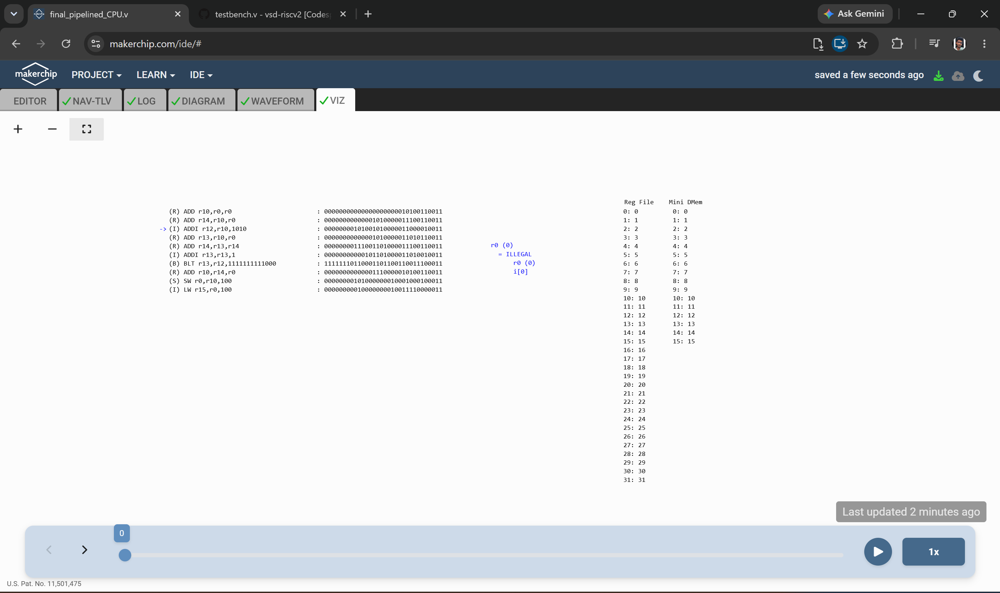
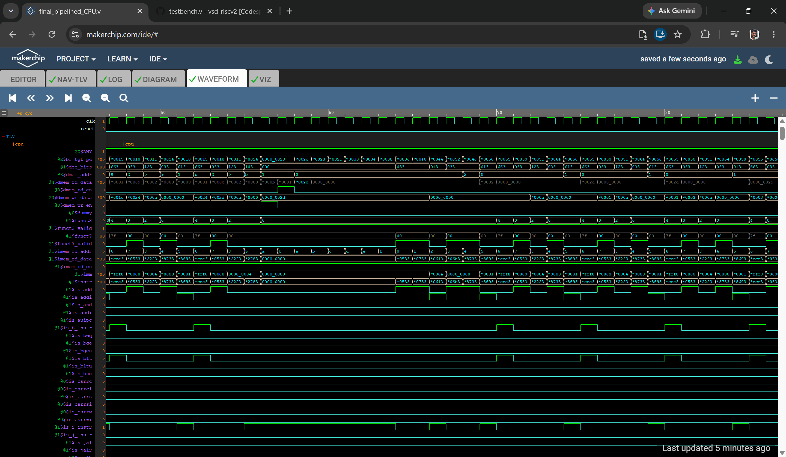
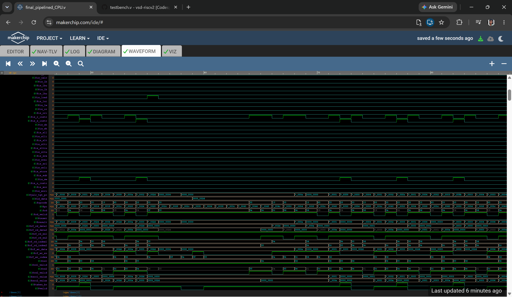
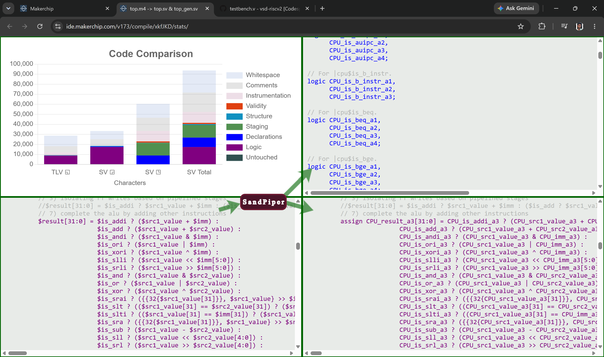

# Day 5 — Complete Pipelined RISC-V CPU Microarchitecture

Day 5 extends the Day 4 single-cycle core into a 3-stage pipelined RISC-V CPU in TL-Verilog, adding hazard handling (bypass, branch shadowing, load shadowing) and a data memory interface, then verifying it against an extended "sum 1 to 9" test program that also exercises store and load instructions.

> **Note on file organization:** Makerchip's save/download flow reuses the same default filename across projects, which led to some local files being overwritten while working through these labs. As a result, a few checkpoint files may not perfectly reflect their individual step names — some later-stage logic may appear earlier than expected, or vice versa. The overall progression and final working version are accurate; only some intermediate save-point labels may not line up exactly.

---

## Build Progression

Each file is a checkpoint of the pipeline build at that stage (verified from the actual TL-Verilog content, not just the filename).

| Step | File | What it adds |
|---|---|---|
| 1 | `3_cycle_valid.v` | Introduces the 3-cycle `$valid` signal |
| 2 | `avoiding_invalid_instr.v` | suppresses PC redirection / register writes for invalid (bubble) cycles as the pipeline is first spun up |
| 3 | `adding_stages.v` | Splits execution across dedicated register-read (`@2`) and ALU (`@3`) stages |
| 4 | `register_file_bypass.v` | Adds register-file bypass (`>>1$rf_wr_en` / `>>1$result` forwarding) to resolve RAW hazards between back-to-back dependent instructions  |
| 5 | `branch_target.v` | Refines the branch-target path so a valid instruction is available every cycle after a taken branch |
| 6  | `decode_other_instructions.v` | Completes instruction decode for the remaining RV32I instruction set (arithmetic/logical immediates, shifts, LUI/AUIPC/JAL, and adds `$is_load`/`$is_sb`/`$is_sh`/`$is_sw` detection) |
| 7 | `completing_the_alu_for_other_instr.v` | Wires the full ALU (`ADD/SUB/AND/OR/XOR/shifts/SLT/SLTU/...`) to cover every decoded instruction |
| 8 | `load_shadow.v` | Adds load-shadow logic: PC holds steady and `$valid` is suppressed for the cycles following a load, until the loaded value is available |
| 9 | `load_data_from_mem.v` | Computes the load/store memory address via the ALU (`$src1_value + $imm`) and preps the register-write mux to select loaded data |
| 10 | `dmem_inst_interface_signals.v` | Instantiates the data memory (`m4+dmem`) and wires `$dmem_rd_en`, `$dmem_wr_en`, `$dmem_addr`, `$dmem_wr_data`, `$ld_data` |
| 11 | `final_pipelined_CPU.v` | **Final integrated pipeline** — adds `JALR` control flow, appends `SW`/`LW` to the test program itself, and verifies the value survives a full store→load round-trip through data memory |

---

## Final Core (`final_pipelined_CPU.v`)

The completed 3-stage pipelined core:

- Fetches and decodes the full RV32I instruction set used across Day 4–5 (R/I/S/B/U/J types, including loads and stores)
- Resolves RAW hazards via same-cycle-window register bypass (`@2`→`@3` forwarding)
- Redirects the PC correctly for three separate control-flow cases: taken branches, `JALR`, and the shadow cycle following a load
- Reads and writes data memory through a proper `dmem` interface (`$dmem_rd_en`, `$dmem_wr_en`, `$dmem_addr`, `$dmem_wr_data`, `$ld_data`)
- Extends the "sum 1 to 9" test program with a store and a load:
  ```
  m4_asm(SW, r0, r10, 100)   // store the computed sum to memory
  m4_asm(LW, r15, r0, 100)   // load it back into r15
  ```
- Final check verifies the round-trip through memory, not just the ALU result:
  ```
  *passed = |cpu/xreg[15]>>5$value == (1 + 2 + 3 + 4 + 5 + 6 + 7 + 8 + 9);
  ```








---

## Key Takeaways from Day 5

- How a single-cycle CPU is converted into a pipelined one by splitting the datapath across stages (`@0`–`@3`) and managing the resulting hazards
- RAW hazard resolution via register-file bypass/forwarding, instead of stalling
- Why branches and loads each need their own "shadow" handling — a taken branch or an in-flight load invalidates the instructions already fetched behind it, and the pipeline must suppress their side effects (register/PC writes) until the correct path is known
- How a data memory interface (`dmem`) is wired into a pipelined core, and why load data can only be available a fixed number of cycles after the request
- Verifying a pipelined design isn't just "does the ALU work" — the final test here explicitly proves data survives a full store→load round trip through memory, which exercises the load-shadow and dmem-interface logic together

---
